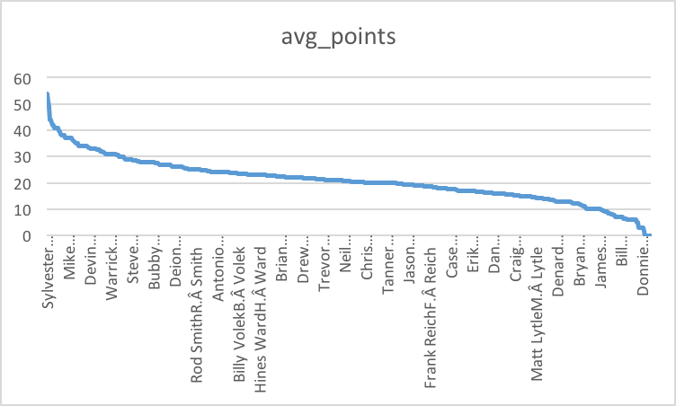
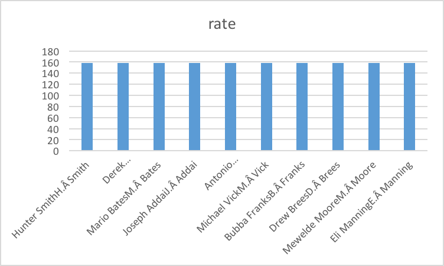

# Checkpoint-3
## Description of datasets.sat_scores
This dataset gives information on every NFL game and every passer over 5000 regular season games from 1996 to 2016. The excel files supplies us with over ten thousand quarterbacks’ names over 21 years and specifies the success of each one. Each year contains every single game from that season and gives statistics like completions, attempts, yards, and an overall rating for the quarterback for that game.

##Question 1
--Do NFL fans know more about who the best quarterbacks are?
```select
qb,
avg(game_points) as avg_points
from datasets.qbstats_1996_2016
group by qb
order by avg_points DESC

```


##Qestion 2
--Who were the top 10 highest rating quarterbacks?
```sql
select
qb,
rate
from datasets.qbstats_1996_2016
Where rate is NOT NULL
group by qb,rate
order by rate DESC
Limit 10

```


##Qestion 3
--rank the students’ school from highest to lowest by hrs_studied
```SELECT school, hrs_studied
FROM datasets.sat_scores 
ORDER BY hrs_studied DESC
```


##Qestion 4
--which students has the sat_writing scores over 600?
```SELECT student_id, sat_writing 
FROM datasets.sat_scores
WHERE sat_writing >600
ORDER BY sat_scores ASC 
```


##Qestion 5
--which students has the highst sat_verbal score?
```SELECT student_id, sat_verbal
FROM datasets.sat_scores
ORDER BY sat_verbal DESC
```


##Qestion 6

##Qestion 7

##Qestion 8

##Qestion 9

##Qestion 10
