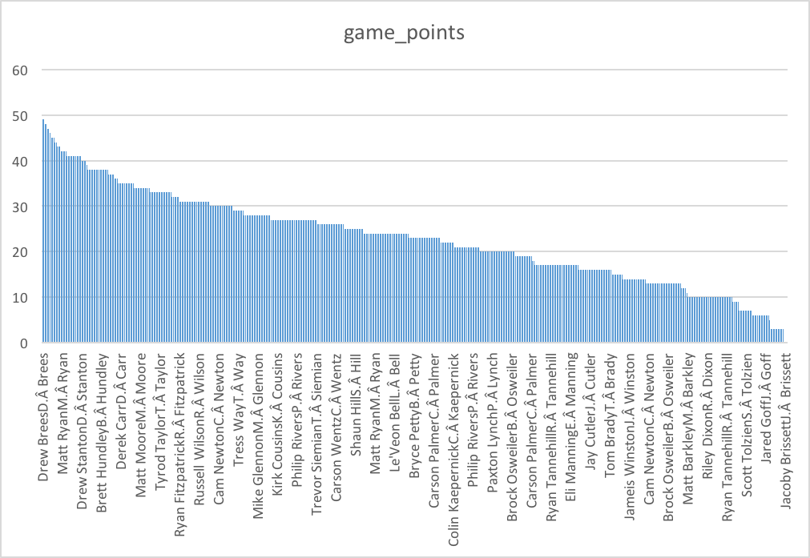
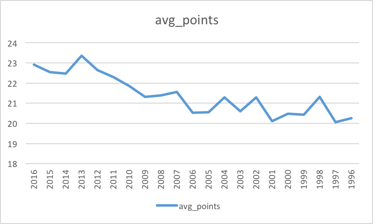
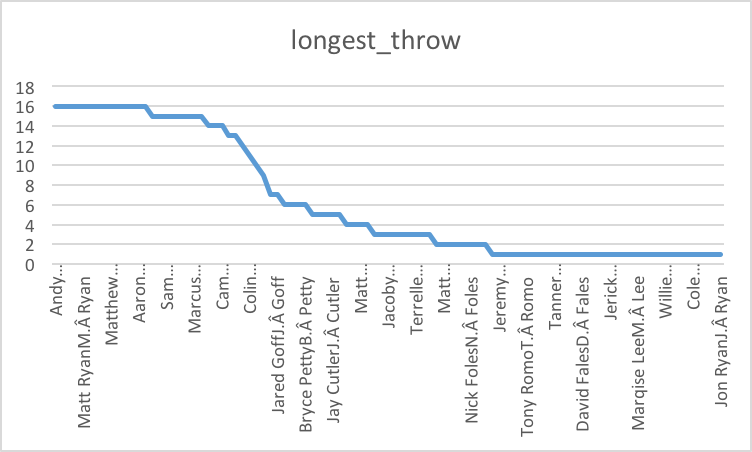

# Checkpoint-3
## Description of datasets.qbstats_1996_2016
This dataset gives information on every NFL game and every passer over 5000 regular season games from 1996 to 2016. The excel files supplies us with over ten thousand quarterbacks’ names over 21 years and specifies the success of each one. Each year contains every single game from that season and gives statistics like completions, attempts, yards, and an overall rating for the quarterback for that game.

## Question 1
--Do NFL fans know more about who the best quarterbacks are?
```sql
select
qb,
avg(game_points) as avg_points
from datasets.qbstats_1996_2016
group by qb
order by avg_points DESC

```


## Question 2
--Who were the top 10 highest rating quarterbacks?
```sql
select
qb,
rate
from datasets.qbstats_1996_2016
Where rate is NOT NULL
group by qb,rate
order by rate DESC
Limit 10

```


## Question 3
--Who were top 10 quarterbacks with highest game points in 2016?

```sql
select
qb,
game_points
from datasets.qbstats_1996_2016
where year=2016
order by game_points DESC
Limit 10

```


## Question 4
--Where do the quarterbacks perform better in 2016, at home or away?
```sql
select
qb,
game_points,
home_away
from datasets.qbstats_1996_2016
where year=2016
order by game_points DESC

```

## Question 5
--What is the average game points each year?
```sql
Select year, avg(game_points) as average_points
From datasets.qbstats_1996_2016
Group by year
Order by year DESC

```


## Question 6
--Who throw longest in 2016?
```sql
Select qb, count(lg) as longest_throw
From datasets.qbstats_1996_2016
Where year = 2016
Group by qb
Order by longest_throw DESC

```
!

## Question 7
--Who had the most touchdowns (td) in 2016?
```sql
Select qb, count(td) as times
From datasets.qbstats_1996_2016
Where year = 2016
Group by qb
Order by times DESC
```

## Question 8
--Which quarterback played in the most games in 2016?
```sql
Select qb, count(qb) as most_appearances
From datasets.qbstats_1996_2016
Where year >= 2016 
Group by qb
Order by most_appearances DESC

```

## Question 9
--Which quarterback had the least amount of interceptions in 2016?
```sql
Select qb, count(int) as least_interceptions
From datasets.qbstats_1996_2016
Where year = 2016
Group by qb
Order by least_interceptions ASC
```

## Question 10
--Which quarterback is the most qb that tried to throw the ball in 2016?
```sql
Select qb, count(att) as times
From datasets.qbstats_1996_2016
Where year = 2016
Group by qb
Order by times DESC
```
